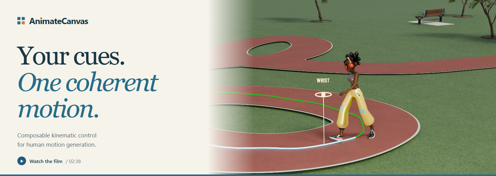
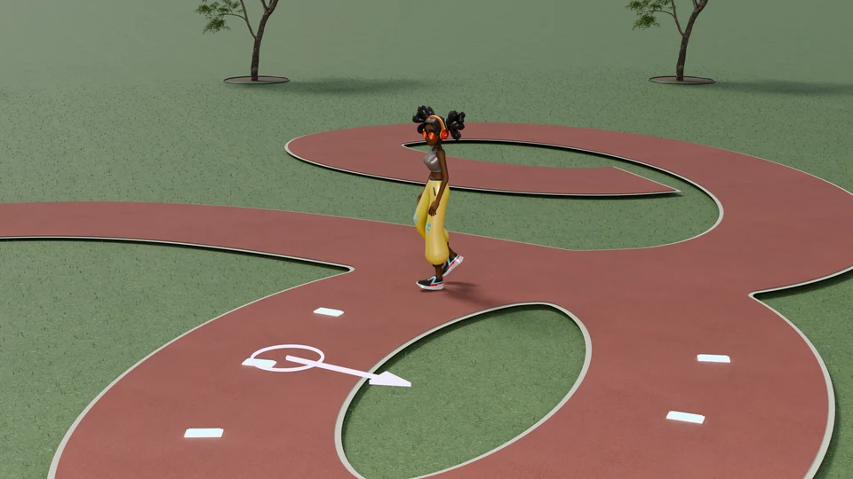

<p align="center">
  <a href="https://zeyuling.github.io/AnimateCanvas/#demo"></a>
</p>

<h2 align="center">Learning Implicit Motion Planning<br>from Composable Kinematic Cues</h2>

<p align="center">
  Zeyu Ling · Di Kang · Qing Shuai · Yuxin Wen · Jing Li<br>
  Zhanke Wang · Heng Li · Chunchao Guo · Changqing Zou* · Linchao Bao
</p>
<p align="center"><sub>Zhejiang University · Tencent · Peking University · Sun Yat-sen University · Zhejiang Lab<br>* Corresponding author</sub></p>

<p align="center">
  <a href="https://zeyuling.github.io/AnimateCanvas/assets/AnimateCanvas.pdf"></a>
  <a href="https://github.com/ZeyuLing/AnimateCanvas#quick-start"></a>
  <a href="https://huggingface.co/ZeyuLing/Motius-MotionCanvas-0.46B"></a>
  <a href="https://github.com/ZeyuLing/AnimateCanvas/releases/tag/animatecanvas-official-demo-20260918"></a>
  <a href="https://zeyuling.github.io/AnimateCanvas/"></a>
  <a href="https://github.com/ZeyuLing/Motius"></a>
</p>

**One motion canvas. Composable control.** AnimateCanvas generates full-body motion
from position and rotation cues specified across joints and time, with optional
language and input motion. One model supports temporal completion, spatial control,
sequential generation, language-guided editing, and repair while retaining
text-to-motion generation.

**Standalone inference, fully integrated in [Motius](https://github.com/ZeyuLing/Motius).**
This repository includes the motion transformer, text encoder interface, checkpoint
loader, flow sampler, cue imputation, and skeleton decoding. **Installing Motius is
not required.** For training, automatic repair, optional IK refinement, evaluation,
and the wider motion-tool ecosystem, use the full Motius integration.

> **Model weights are public:** download the checkpoint from
> [Hugging Face](https://huggingface.co/ZeyuLing/Motius-MotionCanvas-0.46B).
> The legacy model identifier is retained for Motius compatibility.

## See it in motion

**[Official credited demo · 1440p / Chinese-captioned 1080p](https://github.com/ZeyuLing/AnimateCanvas/releases/tag/animatecanvas-official-demo-20260918)**

The formal release includes author credits, affiliations, and project links.

<table>
<tr>
<td width="33%" align="center"><a href="https://zeyuling.github.io/AnimateCanvas/assets/showcase/route-v56.mp4"></a><br><b>Trajectories + local cues</b></td>
<td width="33%" align="center"><a href="https://zeyuling.github.io/AnimateCanvas/assets/showcase/footsteps-animatecanvas.mp4"></a><br><b>Sparse positions + heading</b></td>
<td width="33%" align="center"><a href="https://zeyuling.github.io/AnimateCanvas/assets/showcase/jump-v56.mp4"></a><br><b>Keyframes + trajectories</b></td>
</tr>
<tr>
<td align="center"><a href="https://zeyuling.github.io/AnimateCanvas/assets/showcase/editing-v56.mp4"></a><br><b>Language-guided editing</b></td>
<td align="center"><a href="https://zeyuling.github.io/AnimateCanvas/assets/showcase/boxing-v56.mp4"></a><br><b>Composed local controls</b></td>
<td align="center"><a href="https://zeyuling.github.io/AnimateCanvas/assets/showcase/basketball-animatecanvas.mp4"></a><br><b>Timed spatial targets</b></td>
</tr>
</table>

[Full narrated demo](https://zeyuling.github.io/AnimateCanvas/#demo) ·
[Benchmark gallery](https://zeyuling.github.io/AnimateCanvas/#benchmarks) ·
[Media provenance](https://github.com/ZeyuLing/AnimateCanvas/blob/main/MEDIA.md)

## Quick start

Use Python 3.10+ and install a CUDA-compatible PyTorch build for GPU inference.
The model uses CLIP and Qwen3 text encoders; allow approximately 20 GB of disk
space for the complete download. The text encoder is loaded lazily and currently
runs on CPU, so substantial system RAM is also required. GPU memory requirements
for the full public checkpoint have not yet been benchmarked in this release.

```bash
git clone https://github.com/ZeyuLing/AnimateCanvas.git
cd AnimateCanvas
python -m pip install -e .
python examples/generate.py --task text \
  --text "A person walks forward and waves." --frames 180 \
  --output outputs/walking.npz
```

The default checkpoint is `ZeyuLing/Motius-MotionCanvas-0.46B` and is downloaded
automatically. Use `--cache-dir /path/to/large/cache` to choose its cache, or
`--checkpoint /path/to/checkpoint --local-files-only` for offline loading. Install
PyTorch for your hardware before installing this package; a CPU-only installation
cannot run the default `--device cuda`. `--device cpu` is available but full-model
CPU generation is not a practical performance recommendation.

```python
from animatecanvas import load_pipeline

pipe = load_pipeline()  # public checkpoint, CUDA by default
result = pipe.infer_text_to_motion(
    "A person turns left and continues walking", num_frames=180, seed=42
)
motion = result["motion_198"]
```

### Control, completion, and editing

Start with a generated motion and preserve selected frames as pose cues:

```bash
python examples/make_keyframe_cues.py --source outputs/walking.npz \
  --frames 0 60 120 179 --output outputs/keyframes.npz
python examples/generate.py --task completion --cues outputs/keyframes.npz \
  --text "A person walks forward and waves." --output outputs/completed.npz
```

Create an NPZ with `motion` and `generation_mask`, each shaped `(T, 198)` or
`(B, T, 198)`. Use physical-space motion in **meters**, **30 fps**, at most
**360 frames**. Mask value **0 preserves a cue**, and **1 generates a value**.

```bash
python examples/generate.py --checkpoint /path/to/checkpoint --local-files-only \
  --task control --cues cues.npz --text "A person walks along the path." \
  --output outputs/controlled.npz

python examples/generate.py --checkpoint /path/to/checkpoint --local-files-only \
  --task edit --cues input_motion_and_mask.npz --text "Wave with the right hand." \
  --output outputs/edited.npz
```

Use `--task completion` for temporal completion. Editing additionally uses the
input motion as context in the regions being regenerated. The CLI does not
silently apply IK, resample motion, or retarget skeletons.

[Canvas format and cue preparation](docs/canvas.md) ·
[Motius integration and training](docs/motius.md)

## How it works


- **Compose:** place heterogeneous kinematic cues on one canvas across frames,
  joints, and position or rotation channels.
- **Generate:** use a shared flow-matching model with optional language and input motion.
- **Preserve:** impute specified canvas values during training and sampling.

Outputs include `motion_198`, `rot6d`, `transl`, and FK-decoded `keypoints3d`.
This package produces motion arrays, not rendered videos or character meshes.

Root translation and local rotation cues are directly preserved. Non-root
positions are decoded through forward kinematics, so exact canvas preservation
does not imply exact decoded joint positions. Optional IK is a separate refinement.

## Motius integration

### In this repository

```text
animatecanvas/
  bundle.py       # checkpoint loading, text conditioning, normalization, decode
  pipeline.py     # flow sampling and cue imputation
  network/        # motion transformer, attention, text encoder interface
  kinematics/     # rotation conversions and skeleton FK
  io.py           # canvas NPZ validation and motion output
examples/         # generation CLI and keyframe cue preparation
tests/            # real tiny-network inference, I/O and dependency checks
```

### Full ecosystem

| Capability | Maintained entry point |
| --- | --- |
| Text-to-motion | `infer_text_to_motion` |
| Temporal completion | `infer_temporal_motion_completion` |
| Spatial and composed control | `infer_kinematic_motion_control` |
| Language-guided editing | `infer_motion_editing` |
| Automatic repair (Motius) | `infer_motion_repair` |
| Training | [Trainer and configuration](docs/motius.md) |
| Sequential generation | [Motius model card and task documentation](https://github.com/ZeyuLing/Motius/blob/main/docs/model_zoo/motioncanvas.md) |

Existing `MotionCanvas` / `motioncanvas` API identifiers and the checkpoint ID
are retained for compatibility; the paper and public project name is **AnimateCanvas**.

## Citation

```bibtex
@misc{ling2026animatecanvas,
  title={AnimateCanvas: Learning Implicit Motion Planning from Composable Kinematic Cues},
  author={Zeyu Ling and Di Kang and Qing Shuai and Yuxin Wen and Jing Li and Zhanke Wang and Heng Li and Chunchao Guo and Changqing Zou and Linchao Bao},
  year={2026}
}
```

The arXiv identifier will be added once the submission has been announced.

## Testing and licenses

```bash
python -m unittest discover -s tests -v
```

Tests include actual CPU sampling with a tiny randomly initialized transformer,
hard-cue preservation, FK decoding, checkpoint roundtrip, and NPZ output. They do
not require public model downloads and are not a pretrained motion-quality test.
See [validation](docs/validation.md) for the verified scope.

The original inference entry points, examples, and tests in this repository are released
under the [MIT license](LICENSE). See [NOTICE](NOTICE.md) for its scope.
Adapted implementation code retains its upstream provenance and applicable terms.
Checkpoints, training data, body models, and character meshes are not included.
Rendered media does not grant redistribution rights to the underlying assets.
